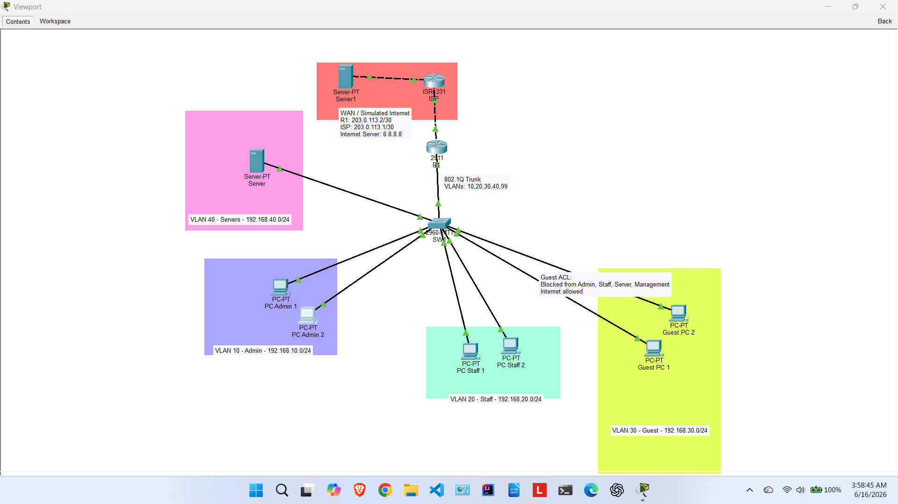
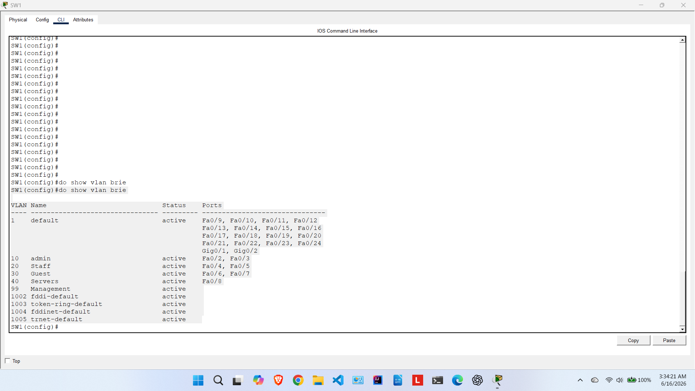
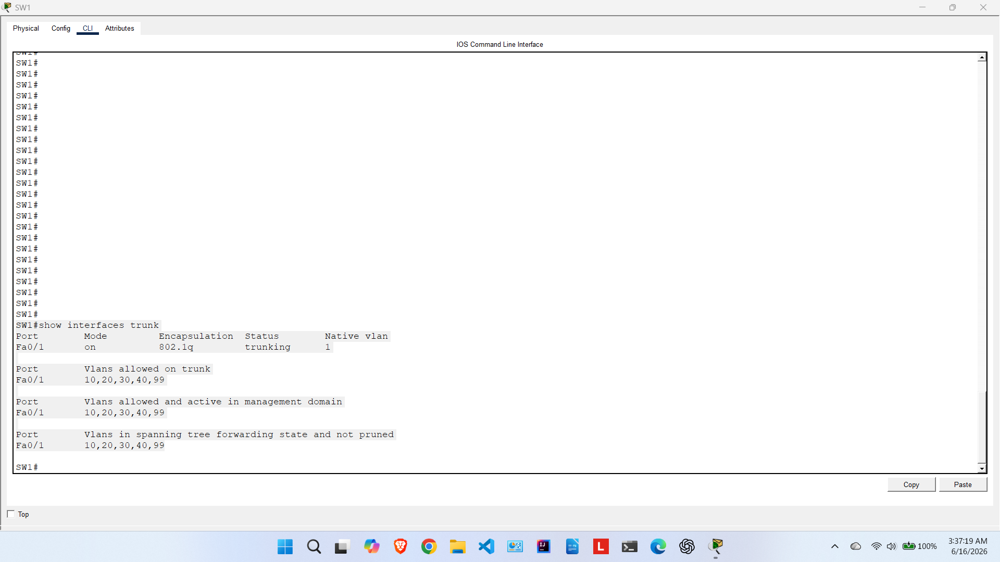
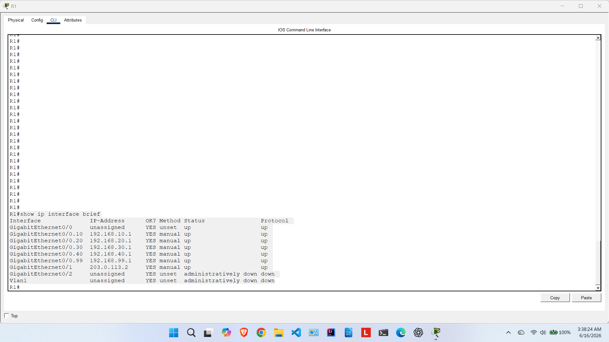
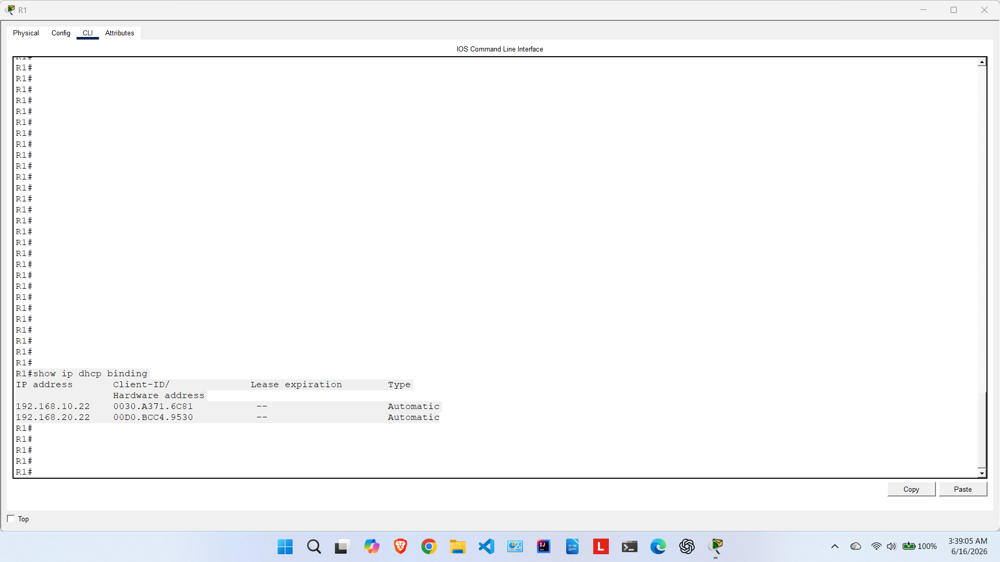
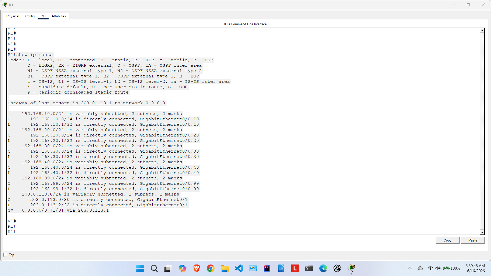
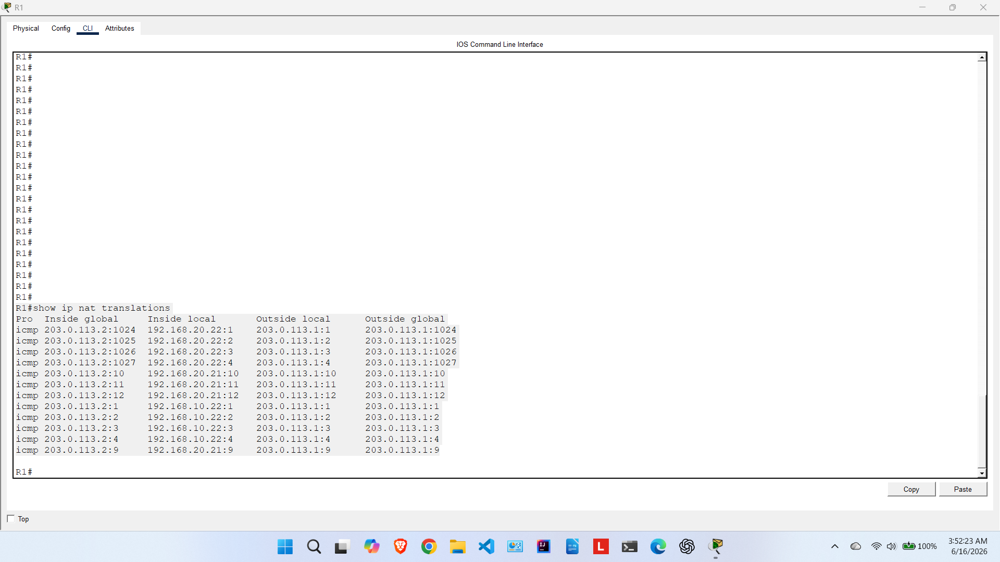
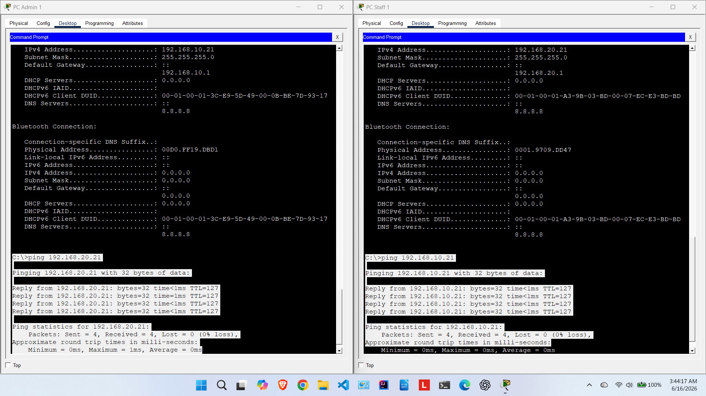
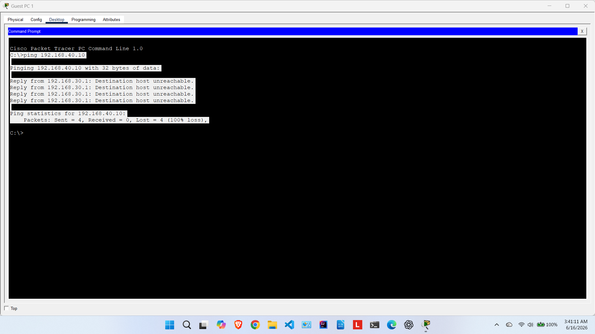
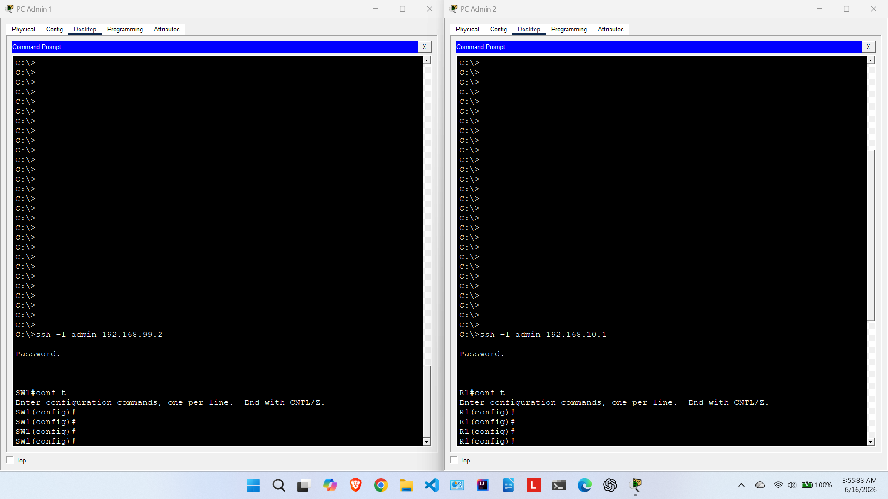

# Small Business Network Design and Configuration Lab

## Overview

This project simulates a small business network using Cisco Packet Tracer. The network is designed with multiple VLANs, inter-VLAN routing, DHCP, NAT/PAT, ACL-based security, SSH remote management, and a simulated internet connection.

The purpose of this lab is to demonstrate practical CCNA-level networking skills, including network design, device configuration, troubleshooting, and verification.

---

## Network Topology



---

## Technologies Used

* Cisco Packet Tracer
* Cisco IOS
* VLANs
* 802.1Q trunking
* Router-on-a-stick
* Inter-VLAN routing
* DHCP
* NAT/PAT
* Access Control Lists
* SSH remote management
* IPv4 subnetting
* Network troubleshooting

---

## Network Design Summary

The network is divided into separate VLANs to improve organization, security, and traffic segmentation.

| VLAN ID | VLAN Name  | Subnet          | Gateway      | Purpose                   |
| ------: | ---------- | --------------- | ------------ | ------------------------- |
|      10 | Admin      | 192.168.10.0/24 | 192.168.10.1 | Admin users               |
|      20 | Staff      | 192.168.20.0/24 | 192.168.20.1 | Staff users               |
|      30 | Guest      | 192.168.30.0/24 | 192.168.30.1 | Guest users               |
|      40 | Servers    | 192.168.40.0/24 | 192.168.40.1 | Internal server network   |
|      99 | Management | 192.168.99.0/24 | 192.168.99.1 | Network device management |

---

## Key Features Implemented

* Created VLANs for Admin, Staff, Guest, Servers, and Management networks.
* Configured access ports for end-user devices.
* Configured an 802.1Q trunk between SW1 and R1.
* Implemented router-on-a-stick for inter-VLAN routing.
* Configured DHCP pools on R1 for client VLANs.
* Assigned a static IP address to the internal server.
* Configured NAT/PAT for internet access through the WAN interface.
* Added a default route from R1 to the ISP router.
* Configured ACLs to restrict Guest VLAN access to internal networks.
* Configured SSH for secure remote access to R1 and SW1.
* Verified network functionality using ping, routing table, DHCP bindings, NAT translations, and SSH login tests.

---

## IP Addressing Summary

| Device          | Interface / VLAN | IP Address       | Purpose                    |
| --------------- | ---------------- | ---------------- | -------------------------- |
| R1              | G0/0.10          | 192.168.10.1/24  | Admin VLAN gateway         |
| R1              | G0/0.20          | 192.168.20.1/24  | Staff VLAN gateway         |
| R1              | G0/0.30          | 192.168.30.1/24  | Guest VLAN gateway         |
| R1              | G0/0.40          | 192.168.40.1/24  | Server VLAN gateway        |
| R1              | G0/0.99          | 192.168.99.1/24  | Management VLAN gateway    |
| R1              | G0/1             | 203.0.113.2/30   | WAN link to ISP            |
| ISP             | G0/0             | 203.0.113.1/30   | Link to R1                 |
| ISP             | G0/1             | 8.8.8.1/24       | Simulated internet network |
| SW1             | VLAN 99          | 192.168.99.2/24  | Switch management          |
| Server          | NIC              | 192.168.40.10/24 | Internal server            |
| Internet Server | NIC              | 8.8.8.8/24       | Simulated internet server  |

---

## Security Controls

The Guest VLAN was restricted using an extended access control list. Guest users are not allowed to access internal business VLANs, including Admin, Staff, Server, and Management networks.

Guest VLAN policy:

| Source        | Destination        | Action |
| ------------- | ------------------ | ------ |
| Guest VLAN 30 | Admin VLAN 10      | Deny   |
| Guest VLAN 30 | Staff VLAN 20      | Deny   |
| Guest VLAN 30 | Server VLAN 40     | Deny   |
| Guest VLAN 30 | Management VLAN 99 | Deny   |
| Guest VLAN 30 | Internet/WAN       | Permit |

Unused switch ports were also shut down to improve basic switch security.

---

## Verification Results

| Test                            | Expected Result                         | Status |
| ------------------------------- | --------------------------------------- | ------ |
| VLANs created on SW1            | VLANs 10, 20, 30, 40, 99 visible        | Passed |
| Trunk link configured           | Fa0/1 trunking with allowed VLANs       | Passed |
| Router subinterfaces configured | R1 subinterfaces up/up                  | Passed |
| DHCP address assignment         | PCs receive correct VLAN IP addresses   | Passed |
| Admin PC to Staff PC ping       | Successful                              | Passed |
| Guest PC to Server ping         | Blocked                                 | Passed |
| R1 default route                | Default route points to ISP             | Passed |
| NAT/PAT                         | Internal addresses translated to WAN IP | Passed |
| SSH to SW1                      | Successful remote login                 | Passed |

---

## Screenshots

### Full Topology


### VLAN Verification



### Trunk Verification



### Router Interface Verification



### DHCP Verification



### Routing Table



### NAT Verification



### Admin to Staff Ping Test



### Guest VLAN Blocked from Server



### SSH Login Test



---

## Project Files

```text
small-business-network-lab/
│
├── README.md
├── packet-tracer-file/
│   └── small-business-network-lab.pkt
├── configs/
│   ├── R1-running-config.txt
│   ├── SW1-running-config.txt
│   └── ISP-running-config.txt
├── screenshots/
│   ├── 01-full-topology.png
│   ├── 02-show-vlan-brief.png
│   ├── 03-show-interfaces-trunk.png
│   ├── 04-show-ip-interface-brief.png
│   ├── 05-show-ip-dhcp-binding.png
│   ├── 06-show-ip-route.png
│   ├── 07-show-ip-nat-translations.png
│   ├── 08-admin-staff-ping-success.png
│   ├── 09-guest-server-ping-blocked.png
│   └── 10-ssh-login-success.png
└── documentation/
    ├── ip-addressing-table.md
    ├── vlan-table.md
    ├── verification-tests.md
    └── troubleshooting-notes.md
```

---

## Skills Demonstrated

* VLAN creation and port assignment
* Trunk configuration
* Router-on-a-stick configuration
* Inter-VLAN routing
* DHCP configuration
* NAT/PAT configuration
* Static and default routing
* ACL-based traffic filtering
* SSH remote access
* Network verification and troubleshooting
* Technical documentation

---

## Outcome

This lab successfully demonstrates a complete small business network design with segmented VLANs, secure guest access, DHCP-based addressing, internet connectivity using NAT/PAT, and SSH management. The project provides practical proof of CCNA-level networking knowledge and hands-on configuration ability.
